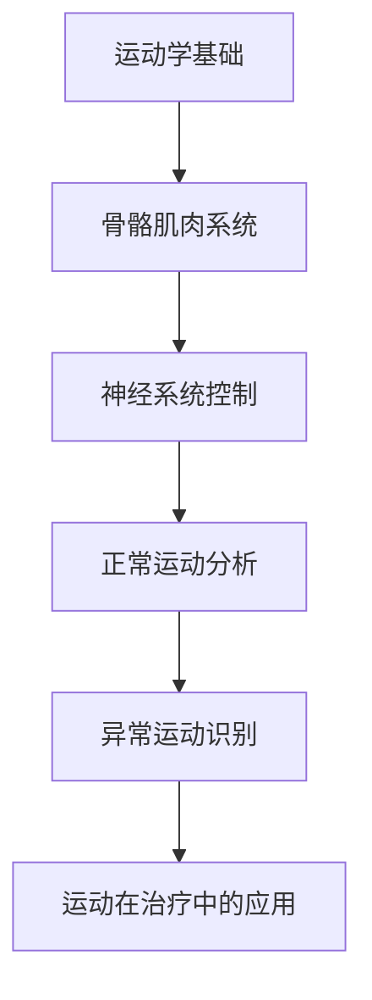

# 运动学

> 🏃 运动学（Kinesiology）是康复医学的重要基础，研究人体运动的力学原理和生理机制。

---

## 📚 课程介绍

运动学是连接**基础医学**和**康复治疗**的桥梁学科，主要研究：

- 人体运动的解剖学基础
- 人体运动的生理学机制
- 人体运动的生物力学原理
- 正常与异常运动模式的识别与分析

---

## 🎯 学习目标

完成本课程后，你将能够：

1. ✅ 理解人体运动的基本形式和原理
2. ✅ 掌握正常步态的分析方法
3. ✅ 识别常见的异常运动模式
4. ✅ 将运动学原理应用于康复治疗
5. ✅ 为运动疗法、运动损伤康复打下基础

---

## 📖 学习资源

### 🎥 在线视频课程

| 课程名称 | 平台 | 语言 | 链接 |
|---------|------|------|------|
| 运动疗法 | 中国大学 MOOC（上海体育大学） | 中文 | [前往学习](https://www.icourse163.org/learn/SUS-1205805805) |
| Kinesiology | Coursera | 英文 | [Coursera：Kinesiology](https://www.coursera.org/learn/kinesiology) |
| Human Movement Science | edX | 英文 | [edX：Human Movement Science](https://www.edx.org/course/human-movement-science) |

### 📚 推荐教材

| 教材名称 | 作者/出版社 | 说明 |
|---------|--------------|------|
| 《运动学》 | 人民卫生出版社 | 国内经典教材，康复专业必修 |
| *Kinesiology: Scientific Basis of Human Motion* | Hamilton, Luttgens | 国际经典教材 |
| 《运动解剖学》 | 北京体育大学出版社 | 辅助理解运动的解剖学基础 |

### 📝 辅助学习资源

- [3D Muscle Anatomy](https://www.visiblebody.com/)（3D 肌肉解剖软件）
- [Gait Analysis](https://www.clinicalgaitanalysis.com/)（步态分析资源）
- [运动学动画](https://www.pt.com/)（辅助理解复杂运动）

---

## 🗺️ 学习路线图

---

## 📅 学习时长预估

| 学习内容 | 预估时长 | 说明 |
|---------|----------|------|
| 运动学基础 | 2-4 周 | 基本概念和原理 |
| 骨骼肌肉系统 | 4-8 周 | 各类关节运动和肌肉功能 |
| 神经系统控制 | 2-4 周 | 运动控制的神经机制 |
| 正常运动分析 | 4-8 周 | 步态分析、平衡分析等 |
| 异常运动识别 | 4-8 周 | 常见异常步态和姿势 |
| 总计 | **2-4 个月** | 可根据背景加速 |

---

## 📝 学习重点

### 1. 运动学基础

- 运动的平面和轴
- 关节类型和运动方向
- 杠杆原理在运动中的应用
- 运动的生理基础

### 2. 骨骼肌肉系统

- 脊柱的运动：屈曲、伸展、侧屈、旋转
- 上肢运动：肩、肘、腕、手
- 下肢运动：髋、膝、踝、足
- 肌肉功能分析：原动肌、拮抗肌、协同肌

### 3. 神经系统控制

- 运动单位和运动神经元
- 反射和运动控制
- 小脑、基底节在运动控制中的作用
- 感觉反馈与运动调节

### 4. 正常运动分析

- **步态分析**：正常步态周期、步行参数
- **平衡与协调**：静态平衡、动态平衡
- **姿势控制**：站立、坐位、卧位的姿势控制

### 5. 异常运动识别

- 偏瘫步态、截瘫步态
- 帕金森步态、小脑性共济失调
- 常见异常姿势：圆肩、脊柱侧弯等

---

## 🔗 先修要求

**必须先掌握**：

- ✅ [解剖学](../basics/anatomy.md)（肌肉、骨骼、关节）
- ✅ [生理学](../basics/physiology.md)（神经、肌肉生理）
- ✅ [生物力学](../basics/biomechanics.md)（力学基础）

**建议同时学习**：

- 📚 [康复评定技术](../core/assessment.md)（步态分析、平衡评定）
- 📚 [物理治疗学](../core/physical_therapy.md)（运动疗法）

---

## 💡 学习建议

### 1. 理论与实践结合

- 📖 **理论学习**：认真理解运动学原理
- 🏋️ **自我体验**：在自己的身体上感受各类运动
- 📹 **观察他人**：观察他人的正常/异常运动模式

### 2. 善用辅助工具

- 💻 **3D 解剖软件**：可视化肌肉和运动
- 🎥 **视频课程**：反复观看标准运动演示
- 📊 **案例分析**：学习典型病例的运动分析

### 3. 为临床应用做准备

- 🏥 **临床观察**：在康复科观察患者的异常运动
- 📝 **病例分析**：尝试分析简单病例的运动问题
- 🤝 **请教老师**：向带教老师请教临床经验

---

## 🤔 常见问题

### Q1：运动学和生物力学有什么区别？

**A**：
- **运动学**：更关注人体运动的**生理和解剖学机制**
- **生物力学**：更关注人体运动的**力学原理和数学模型**
- 两者紧密相关，通常一起学习

### Q2：学习运动学有什么用？

**A**：
- 是**运动疗法**的理论基础
- 是**步态分析、运动控制训练**的基础
- 帮助识别异常运动模式，制定针对性治疗方案

### Q3：没有运动背景，能学好运动学吗？

**A**：
- 完全可以！运动学是从基础开始讲解的
- 结合自身体验，更容易理解
- 建议使用 3D 解剖软件辅助学习

---

## 📚 下一步

- [继续学习生物力学 →](../basics/biomechanics.md)
- [开始学习康复评定技术 →](../core/assessment.md)
- [返回学习路线图概览 →](../roadmap/overview.md)

---

**💪 掌握运动学，让你对人体的运动有更深刻的理解！**
