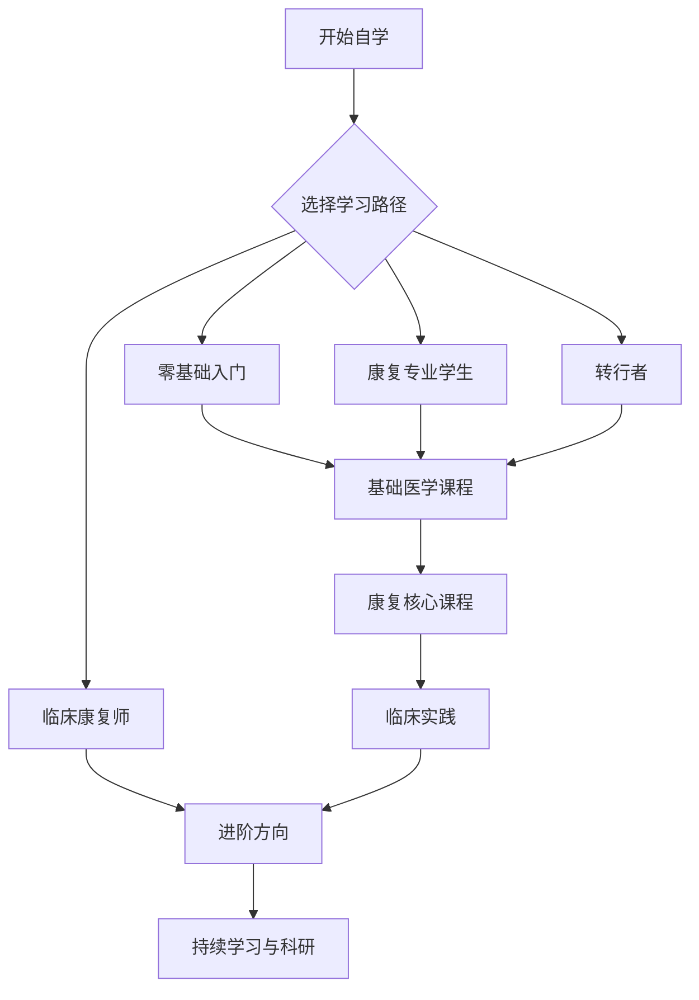

# 如何使用本指南

> 📖 初次使用本指南？这份文档将帮助你快速上手，找到适合自己的学习路径。

---

## 🚀 快速开始

### 第一步：确定你的身份

本指南为四类人群提供定制化学习路径：

| 我是... | 应该看... | 预计时长 |
|---------|----------|----------|
| 零基础爱好者 | [零基础入门路径](../roadmap/beginner.md) | 2-3 年 |
| 康复专业学生 | [康复专业学生路径](../roadmap/student.md) | 1-2 年（补充） |
| 其他专业转行者 | [转行者路径](../roadmap/career_changer.md) | 1.5-2.5 年 |
| 临床康复师 | [临床康复师进阶路径](../roadmap/clinician.md) | 持续学习 |

👉 **不确定自己是哪类？** 查看 [适用人群](target_audience.md) 来确认。

---

### 第二步：了解整体结构

查看 [学习路线图概览](../roadmap/overview.md)，了解本指南的六大模块：

1. **基础医学课程** —— 解剖学、生理学、病理学等
2. **康复核心课程** —— 康复评定、物理治疗、作业治疗等
3. **临床实践** —— 骨科、神经、心肺、儿童康复等
4. **进阶方向** —— 机器人康复、VR/AR、脑机接口、AI 等
5. **好书推荐** —— 中外经典教材和参考书
6. **考证指南** —— 康复治疗师资格证等

---

### 第三步：开始学习

选择你的路径后，按照推荐顺序开始学习：

- 📚 **理论学习**：认真完成课程，做好笔记
- 🏥 **实践积累**：尽早寻找实习或志愿者机会
- 📝 **案例分析**：学习典型病例，模拟制定康复方案
- 🔄 **定期复习**：每隔 2-3 个月复习前面的内容

---

## 🗺️ 学习路线图



详细路线图请查看：[学习路线图](../roadmap/overview.md)

---

## 📂 项目结构说明

```
rehab-self-learning/
├── docs/
│   ├── index.md              # 首页
│   ├── about.md              # 关于本项目
│   ├── contributing.md       # 贡献指南
│   ├── intro/               # 使用指南
│   │   └── target_audience.md
│   ├── roadmap/             # 学习路线图
│   │   ├── overview.md
│   │   ├── beginner.md
│   │   ├── student.md
│   │   ├── career_changer.md
│   │   └── clinician.md
│   ├── basics/             # 基础医学课程
│   ├── core/               # 康复核心课程
│   ├── clinical/           # 临床实践
│   ├── advanced/           # 进阶方向
│   ├── books/              # 好书推荐
│   ├── resources/          # 资源汇总
│   └── certification/      # 考证指南
```

---

## 💡 使用技巧

### 1. 不一定要按顺序学完所有内容

本指南是**模块化**的，你可以：
- 跳过已经掌握的内容
- 根据兴趣选择某些模块深入学习
- 随时跳转到任何感兴趣的章节

### 2. 理论学习 + 实践积累同样重要

康复医学是**实践性很强**的学科：
- 尽早寻找实习/志愿者机会
- 利用模拟病例进行练习
- 观看临床操作视频，模仿标准动作

### 3. 利用好资源汇总页面

- [在线课程平台](../resources/online_courses.md) —— 中国大学MOOC、Coursera、edX 等
- [临床实践指南](../resources/clinical_guidelines.md) —— WHO、中国康复医学会等权威指南
- [学术资源](../resources/academic_resources.md) —— PubMed、知网、康复期刊等
- [社区与论坛](../resources/community.md) —— 康复从业者交流平台

### 4. 保持学习动力

- 🎯 **设定里程碑**：完成每个阶段后给自己奖励
- 📊 **记录进度**：使用学习进度表跟踪学习情况
- 💬 **分享成果**：在社区分享学习心得，获得反馈和鼓励

---

## ❓ 常见问题

### Q1：我没有医学背景，能学会吗？

**A**：完全可以！本指南就是为零基础学习者设计的。只要按照路线图循序渐进，每天坚持学习 2-3 小时，2-3 年完全可以掌握康复专业的核心知识。

### Q2：需要购买哪些教材？

**A**：建议优先购买《解剖学》、《生理学》、《康复医学》、《物理治疗学》这几本核心教材。其他参考书可以根据需要选择。不需要购买所有书，选择 1-2 本精读即可。

### Q3：如何获得实践经验？

**A**：
- 寻找康复科的实习机会
- 参加志愿者活动（如社区康复服务）
- 利用模拟病例进行练习
- 观看临床操作视频，模仿标准动作

### Q4：学完能找到工作吗？

**A**：康复治疗师的需求量很大，但需要注意：
- 不同地区对执业资格的要求不同
- 建议考取康复治疗师资格证
- 实践经验非常重要，尽早积累

---

## 🤝 如何贡献？

本指南是开源项目，欢迎所有康复从业者、学者、学生贡献内容！

贡献方式：
1. 📝 **补充新课程** —— 在对应章节下提交 Pull Request
2. 🐛 **修正错误** —— 发现错误或有改进建议，欢迎提交 Issue 或 Pull Request
3. 💬 **参与讨论** —— 在 Issue 区分享学习心得、提问、交流经验
4. ⭐ **推广项目** —— 如果本指南对你有帮助，请给项目点个 Star

查看详细贡献指南：[贡献指南](../contributing.md)
---

## 📞 联系方式

- **GitHub Issues**：[提交问题或建议](https://github.com/etherealstarry/rehab-self-learning/issues)
- **邮箱**：欢迎通过 GitHub 联系我

---

## 📜 开源协议

本项目原创内容遵循 **MIT 协议**。

引用的课程、书籍、视频等资源遵循原作者规定的许可协议，请在使用时遵守相关规定。

---

## ❤️ 致谢

本项目的灵感来源于 [PKUFlyingPig/cs-self-learning](https://github.com/PKUFlyingPig/cs-self-learning)（CS 自学指南），向开源社区的贡献者们致敬！

---

**🎉 开始你的康复专业自学之旅吧！**

[👉 立即查看适用人群 →](target_audience.md)
