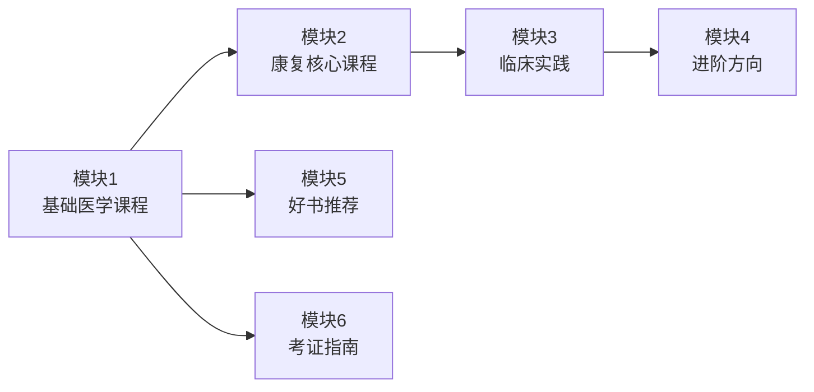

# 学习路线图概览

本指南将康复专业的学习路径分为**六大模块**，每个模块包含若干课程。你可以根据自己的目标人群和兴趣，灵活选择学习顺序和深度。

---

## 🗺️ 六大学习模块

---

## 📚 模块 1：基础医学课程（必修）

**目标**：建立扎实的医学基础知识体系

| 课程 | 重要性 | 预估时长 | 先修要求 |
|------|--------|----------|----------|
| [解剖学](basics/anatomy.md) | ⭐⭐⭐⭐⭐ | 3-6 个月 | 无 |
| [生理学](basics/physiology.md) | ⭐⭐⭐⭐⭐ | 3-6 个月 | 解剖学基础 |
| [病理学](basics/pathology.md) | ⭐⭐⭐⭐ | 2-4 个月 | 生理学基础 |
| [生物力学](basics/biomechanics.md) | ⭐⭐⭐⭐ | 2-4 个月 | 物理学、解剖学 |
| [运动学](basics/kinesiology.md) | ⭐⭐⭐⭐ | 2-4 个月 | 解剖学、生物力学 |
| [心理学基础](basics/psychology.md) | ⭐⭐⭐ | 1-3 个月 | 无 |

**学习建议**：
- 零基础学习者应按照顺序学习
- 有相关背景的学习者可跳过部分课程
- 建议每天投入 1-2 小时

---

## 🏥 模块 2：康复核心课程（必修）

**目标**：掌握康复治疗的核心理论和技能

| 课程 | 重要性 | 预估时长 | 先修要求 |
|------|--------|----------|----------|
| [康复医学概论](core/rehab_intro.md) | ⭐⭐⭐⭐⭐ | 2-3 个月 | 基础医学课程 |
| [康复评定技术](core/assessment.md) | ⭐⭐⭐⭐⭐ | 3-6 个月 | 解剖学、生理学 |
| [物理治疗学](core/physical_therapy.md) | ⭐⭐⭐⭐⭐ | 6-12 个月 | 康复评定技术 |
| [作业治疗学](core/occupational_therapy.md) | ⭐⭐⭐⭐ | 4-8 个月 | 康复评定技术 |
| [言语治疗学](core/speech_therapy.md) | ⭐⭐⭐ | 4-8 个月 | 康复评定技术 |
| [康复工程学](core/rehab_engineering.md) | ⭐⭐⭐ | 2-4 个月 | 物理学、生物力学 |
| [中国传统康复学](core/tcm_rehab.md) | ⭐⭐⭐ | 2-4 个月 | 无 |

**学习建议**：
- 物理治疗学、作业治疗学、言语治疗学可选择 1-2 个深入学习
- 康复工程学适合对技术感兴趣的学习者
- 建议配合临床实习一起学习

---

## 🩺 模块 3：临床实践（必修）

**目标**：将理论应用于临床，掌握常见疾病的康复治疗方法

| 课程 | 重要性 | 预估时长 | 先修要求 |
|------|--------|----------|----------|
| [骨科康复](clinical/orthopedic.md) | ⭐⭐⭐⭐⭐ | 4-8 个月 | 物理治疗学 |
| [神经康复](clinical/neurological.md) | ⭐⭐⭐⭐⭐ | 4-8 个月 | 物理治疗学 |
| [心肺康复](clinical/cardiopulmonary.md) | ⭐⭐⭐⭐ | 2-4 个月 | 生理学、物理治疗学 |
| [儿童康复](clinical/pediatric.md) | ⭐⭐⭐ | 2-4 个月 | 神经康复 |
| [老年康复](clinical/geriatric.md) | ⭐⭐⭐ | 2-4 个月 | 基础医学课程 |
| [运动损伤康复](clinical/sports_injury.md) | ⭐⭐⭐⭐ | 3-6 个月 | 骨科康复 |
| [疼痛管理](clinical/pain_management.md) | ⭐⭐⭐ | 2-4 个月 | 生理学、心理学 |

**学习建议**：
- 骨科康复和神经康复是**最核心**的两个方向，建议优先学习
- 其他方向可根据兴趣和职业规划选择
- **必须配合临床实习**，否则学习效果会大打折扣

---

## 🚀 模块 4：进阶方向（选修）

**目标**：了解康复医学前沿技术，拓展专业视野

| 课程 | 重要性 | 预估时长 | 先修要求 |
|------|--------|----------|----------|
| [机器人康复](advanced/robotics.md) | ⭐⭐⭐ | 2-4 个月 | 康复工程学、临床实践 |
| [VR/AR 康复](advanced/vr_ar.md) | ⭐⭐⭐ | 2-4 个月 | 康复工程学、临床实践 |
| [脑机接口与康复](advanced/bci.md) | ⭐⭐⭐ | 2-4 个月 | 神经康复、康复工程学 |
| [运动神经科学](advanced/motor_neuroscience.md) | ⭐⭐⭐⭐ | 3-6 个月 | 神经康复、生理学 |
| [康复大数据与 AI](advanced/ai_rehab.md) | ⭐⭐⭐⭐ | 3-6 个月 | 编程基础（可选） |

**学习建议**：
- 适合有一定临床经验的康复师或高年级学生
- 可根据兴趣选择 1-2 个方向深入学习
- 建议关注相关领域的顶级期刊和会议

---

## 📖 模块 5：好书推荐（参考）

**目标**：提供中外经典教材和参考书，供深入学习使用

- [中文教材](books/chinese_books.md)：国内康复专业经典教材
- [英文原版](books/english_books.md)：国际通用的权威教材
- [参考书目](books/reference_books.md)：按细分领域分类的参考书

**学习建议**：
- 不需要购买所有书，选择 1-2 本精读即可
- 建议购买最新版本，内容更权威、更及时
- 可先查看图书馆或电子版，再决定是否购买

---

## 📜 模块 6：考证指南（必修）

**目标**：帮助通过康复治疗师资格考试，获得执业资格

- [康复治疗师资格证](certification/therapist.md)：中国康复治疗师执业资格考试指南
- [其他相关证书](certification/other_certs.md)：如运动康复师、健身教练等证书

**学习建议**：
- 建议在第 3-4 年准备考试
- 提前 6-12 个月开始备考
- 结合本指南的临床实践模块一起学习

---

## 🎯 下一步

根据你的目标人群，查看对应的详细学习路径：

- [零基础入门路径](roadmap/beginner.md)
- [康复专业学生路径](roadmap/student.md)
- [转行者路径](roadmap/career_changer.md)
- [临床康复师进阶路径](roadmap/clinician.md)

或者，[立即开始学习基础医学课程 →](basics/anatomy.md)
